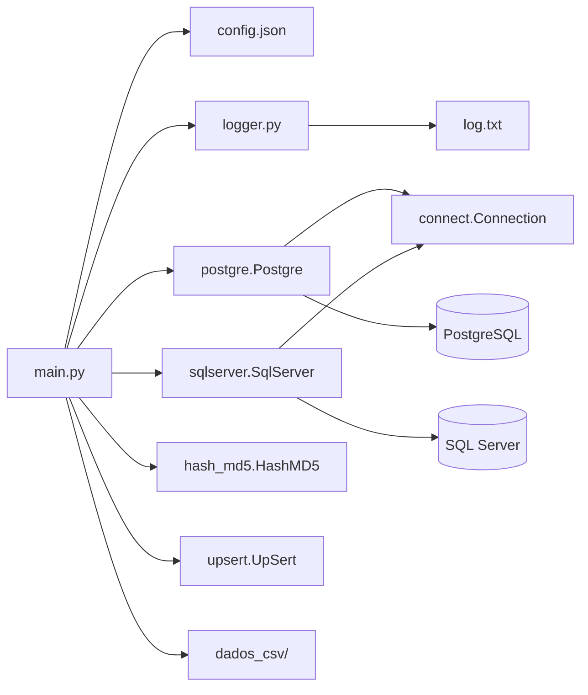
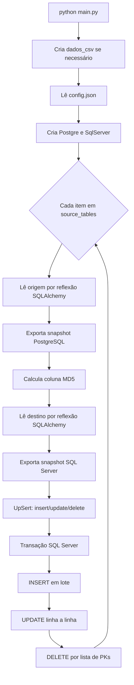
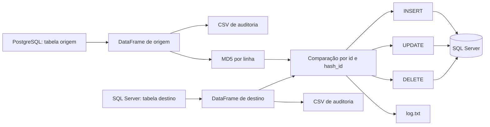

# Migração PostgreSQL → SQL Server

Aplicação Python de ETL para espelhar tabelas do PostgreSQL no SQL Server. O fluxo principal lê uma tabela de origem, calcula uma assinatura MD5 por linha, compara o resultado com a tabela de destino e aplica inserções, atualizações e exclusões. A configuração atual sincroniza `public.usuarios_origem` com `dbo.usuarios`.

> **Atenção:** a sincronização é bidirecional apenas no sentido dos dados: o PostgreSQL é a fonte de verdade. Um registro removido na origem também é removido no SQL Server.

## Índice

- [Resumo executivo](#resumo-executivo)
- [Visão geral e arquitetura](#visão-geral-e-arquitetura)
- [Estrutura do projeto](#estrutura-do-projeto)
- [Fluxo de execução](#fluxo-de-execução)
- [Modelo e fluxo de dados](#modelo-e-fluxo-de-dados)
- [Configuração e banco de dados](#configuração-e-banco-de-dados)
- [Instalação e uso](#instalação-e-uso)
- [Referência dos arquivos, classes e funções](#referência-dos-arquivos-classes-e-funções)
- [Tratamento de erros e logs](#tratamento-de-erros-e-logs)
- [Dependências](#dependências)
- [Limitações e melhorias sugeridas](#limitações-e-melhorias-sugeridas)

## Resumo executivo

O ponto de entrada é `main.py`. Ele carrega `config.json`, constrói conectores SQLAlchemy para PostgreSQL e SQL Server, lê todas as tabelas configuradas e usa `pandas` para comparar os conjuntos de dados. A classe `HashMD5` detecta alterações de conteúdo; `UpSert` separa os registros em três grupos; e `SqlServer` persiste cada grupo dentro de uma transação por tabela.

Não há API, interface web ou agendador embutido. A execução é manual (ou deve ser disparada externamente por cron, CI/CD ou orquestrador). Também não há scripts de DDL: as tabelas e o schema do destino devem existir previamente e ser compatíveis com a origem.

## Visão geral e arquitetura

### Tecnologias

| Item | Uso no projeto |
| --- | --- |
| Python | Linguagem da aplicação. O ambiente local contém Python 3.12; o projeto não declara uma versão mínima. |
| pandas | Representação, exportação CSV e comparação dos dados em `DataFrame`. |
| SQLAlchemy Core | Engines, reflexão de tabelas, consultas e comandos de alteração. |
| psycopg2-binary | Driver PostgreSQL usado pela URL `postgresql+psycopg2`. |
| pyodbc | Driver Python para SQL Server, usado pela URL `mssql+pyodbc`. |
| Docker Compose | Provisionamento opcional de PostgreSQL 17 e SQL Server 2022. |

### Componentes e dependências



O desenho segue uma abstração simples de conectores: `Connection` define a interface esperada e `Postgre`/`SqlServer` implementam particularidades de cada banco. É uma aplicação procedural, não uma arquitetura em camadas formal. O uso de uma classe-base para conectores é próximo do padrão **Template Method/Adapter**, mas não há Factory, Repository ou ORM de domínio.

### Estrutura do projeto

```text
.
├── main.py              # entrada: sincronização incremental
├── mainFULL.py          # tentativa de carga total; não está funcional
├── connect.py           # contrato/base dos conectores
├── postgre.py           # leitura no PostgreSQL
├── sqlserver.py         # leitura e escrita no SQL Server
├── upsert.py            # separa INSERT, UPDATE e DELETE
├── hash_md5.py          # cria hash de comparação por registro
├── logger.py            # logger de arquivo global
├── teste_unitario.py    # carga auxiliar de produtos de uma API no PostgreSQL
├── config.json          # conexões e mapeamentos de tabelas
├── docker-db.yaml       # serviços locais de banco de dados
├── requirements.txt     # dependências Python fixadas
├── dados_csv/           # snapshots CSV exportados durante a execução
└── log.txt              # log em arquivo, criado/alimentado em execução
```

Os CSVs existentes são artefatos de dados/exemplos, não uma fonte usada por `main.py`. A execução principal sobrescreve/cria arquivos com os sufixos `_postgre.csv` e `_sqlserver.csv`.

## Fluxo de execução



Em detalhe, para cada objeto em `source_tables`:

1. `json_data()` lê o arquivo de configuração relativo ao diretório atual.
2. O programa obtém nomes de tabela, schemas, nome da coluna de hash e chave primária configurados.
3. `Postgre.Query_all()` reflete e consulta a tabela inteira da origem.
4. O resultado é gravado em `dados_csv/<tabela_destino>_postgre.csv` **antes** de incluir o hash.
5. `HashMD5.create_columns_md5()` acrescenta uma coluna de checksum a cada linha.
6. `SqlServer.Query_all()` traz a tabela inteira de destino e a exporta para `dados_csv/<tabela_destino>_sqlserver.csv`.
7. `UpSert` compara os dois `DataFrame`s e devolve os subconjuntos a inserir, atualizar e excluir.
8. `with engine_sql.begin()` abre uma transação. `Save`, `Update_where` e `Delete_where` são chamados apenas se houver registros no subconjunto correspondente.
9. Se qualquer escrita dentro desse bloco falhar, SQLAlchemy faz rollback da transação daquela tabela. Ao término normal, faz commit.

### Regras de comparação atuais

| Operação | Regra |
| --- | --- |
| INSERT | ID presente na origem e ausente no destino. |
| UPDATE | ID presente nos dois lados e `hash_id` diferente. |
| DELETE | ID presente no destino e ausente na origem. |

Embora `config.json` contenha `column_pk` e `column_MD5`, a classe `UpSert` usa literalmente as colunas `id` e `hash_id`. Portanto, o mapeamento atual funciona, mas outras chaves ou nomes de hash não funcionam sem ajuste de código.

### Complexidade e impacto

O processo carrega tabelas inteiras na memória e executa merges do pandas. Em termos práticos, o custo é aproximadamente linear para tabelas sem IDs duplicados, mas pode crescer muito com chaves duplicadas (o merge combina todas as ocorrências). Atualizações são enviadas uma a uma; isso é o principal gargalo para grandes volumes. Não há paginação, watermark, CDC nem processamento incremental por data.

## Modelo e fluxo de dados



### Assinatura MD5

Para cada linha de origem, `generate_md5()` converte os valores para texto, junta-os com `|` e gera o MD5. A coluna criada recebe o nome configurado (na configuração padrão, `hash_id`). O hash inclui todas as colunas existentes na origem, na ordem do `DataFrame`; ele não inclui a coluna de hash que está sendo criada.

O destino precisa possuir `hash_id` e conter hash calculado segundo a mesma regra, ou toda linha comum poderá parecer alterada. MD5 aqui é um checksum de comparação, não uma medida de segurança criptográfica.

## Configuração e banco de dados

### `config.json`

| Chave | Significado |
| --- | --- |
| `connection_sqlserver.driver` | Nome do driver ODBC instalado no host, por exemplo `ODBC Driver 18 for SQL Server`. |
| `connection_sqlserver.server` | Host/instância do SQL Server. |
| `connection_sqlserver.database` | Banco de dados de destino. |
| `connection_sqlserver.username` / `password` | Credenciais SQL Server. |
| `connection_postgre.host`, `port`, `database`, `user`, `password` | Credenciais da origem PostgreSQL. |
| `source_tables` | Dicionário de mapeamentos; cada chave representa uma tabela a sincronizar. |
| `schema_origem` / `schema_destino` | Schemas da tabela origem/destino. |
| `table_origem` / `table_destino` | Nomes físicos das tabelas. |
| `column_MD5` | Nome da coluna hash a criar na origem/esperar no destino. |
| `column_pk` | Chave usada na exclusão no `main.py`; na prática deve ser `id` inteiro pelo restante da implementação. |

Exemplo para adicionar outra tabela (somente se sua PK for `id` e o hash for `hash_id`):

```json
"clientes": {
  "schema_origem": "public",
  "schema_destino": "dbo",
  "table_origem": "clientes_origem",
  "table_destino": "clientes",
  "column_MD5": "hash_id",
  "column_pk": "id"
}
```

### Contrato de banco

O repositório não contém migrações SQL nem definição de tabelas. A configuração padrão pressupõe:

| Lado | Objeto | Papel | Chaves/colunas necessárias |
| --- | --- | --- | --- |
| PostgreSQL | `public.usuarios_origem` | Fonte | `id` e colunas de negócio usadas no hash. |
| SQL Server | `dbo.usuarios` | Destino espelhado | `id` como chave única/primária, as colunas de negócio compatíveis e `hash_id`. |

Não é possível documentar chaves estrangeiras, índices ou relacionamentos adicionais porque eles não são definidos nem consultados pelo projeto. Recomenda-se uma PK ou índice único em `dbo.usuarios.id`; sem isso, `UPDATE`/`DELETE` podem afetar mais de uma linha e IDs duplicados tornam a comparação incorreta.

## Instalação e uso

### Pré-requisitos

- Python 3.10+ recomendado (a versão exata não é declarada; o projeto foi inspecionado com 3.12).
- PostgreSQL acessível com a tabela de origem criada.
- SQL Server acessível com a tabela de destino criada.
- No host que executa Python: driver Microsoft ODBC 18 for SQL Server (ou o nome ajustado em `config.json`). O container SQL Server não instala esse driver no host.
- `pip` e, para `psycopg2`/`pyodbc`, as dependências nativas apropriadas ao sistema operacional.

### Criar bancos locais com Docker (opcional)

O arquivo `docker-db.yaml` inicia PostgreSQL 17 na porta 5432 e SQL Server 2022 na porta 1433, com volumes persistentes e as mesmas credenciais padrão de `config.json`.

```bash
docker compose -f docker-db.yaml up -d
```

O comando cria/inicia os serviços em segundo plano. Ele **não cria** `usuarios_origem`, `usuarios`, schemas extras, PKs ou a coluna `hash_id`; crie-os antes da migração.

### Ambiente Python e dependências

```bash
python -m venv venv
source venv/bin/activate          # Linux/macOS
# Windows PowerShell: .\venv\Scripts\Activate.ps1
python -m pip install --upgrade pip
pip install -r requirements.txt
```

O primeiro comando isola bibliotecas do projeto; o segundo ativa o ambiente; e o último instala as versões fixadas.

### Configurar

1. Copie/edite `config.json` com hosts, portas, banco, usuário e senha reais.
2. Ajuste `source_tables` para cada par origem/destino.
3. Garanta que a origem tenha os dados e que a tabela do destino já exista com tipos compatíveis, `id` e `hash_id`.
4. Execute a partir da raiz do projeto, pois `config.json`, `log.txt` e `dados_csv` são caminhos relativos.

Não há suporte a variáveis de ambiente: todas as credenciais são lidas diretamente de `config.json`.

### Executar a sincronização incremental

```bash
python main.py
```

Resultado esperado: mensagens no terminal para leitura, geração de MD5 e operações realizadas; snapshots CSV em `dados_csv/`; e entradas em `log.txt`. Se não houver diferenças, o programa informa que não há dados para inserir, atualizar ou deletar.

### Utilitários não usados no fluxo principal

- `python teste_unitario.py`: baixa produtos de `https://dummyjson.com/products`, seleciona seis campos, calcula `hash_id` e os acrescenta à tabela PostgreSQL `products`. É um utilitário de carga de teste, não um teste automatizado.
- `mainFULL.py`: pretende apagar e recarregar integralmente o destino, mas contém uma chamada a método inexistente; não deve ser usado sem correção.

## Referência dos arquivos, classes e funções

### `main.py` — orquestrador principal

Responsável por todo o ETL incremental. Importa os conectores, hash, comparação, log e `pandas`. É o único ponto de entrada suportado.

#### `json_data()`

Lê e converte `config.json` em dicionário. Não recebe parâmetros; retorna o conteúdo JSON. Propaga erros de arquivo ausente ou JSON inválido.

O bloco `if __name__ == "__main__"` não é uma função: prepara o diretório de CSV, instancia dependências, percorre as tabelas e coordena o fluxo descrito acima. As leituras e o cálculo do hash ocorrem antes da transação; somente as escritas no SQL Server são atômicas por tabela.

### `connect.py` — contrato de conexão

#### Classe `Connection`

Base para conectores de bancos. Inicializa `MetaData` do SQLAlchemy e declara `Engine`, `Query_Delete_all`, `Save`, `Update_where` e `Delete_where` como operações que subclasses devem implementar; todas levantam `NotImplementedError` quando chamadas diretamente.

`Query_all(conn, table, schema)` reflete uma tabela SQLAlchemy, executa `SELECT` de todas as colunas/linhas e retorna `DataFrame`. Recebe uma conexão já aberta, nome e schema. `Postgre` e `SqlServer` o duplicam, portanto a implementação da base não é a usada no fluxo atual.

### `postgre.py` — adaptador da origem

#### Classe `Postgre(Connection)`

Armazena as credenciais PostgreSQL e mantém `MetaData` próprio.

- `Engine()`: monta a URL `postgresql+psycopg2://...` e retorna uma engine SQLAlchemy. Envolve falhas na criação com uma mensagem mais específica.
- `Query_all(conn, table, schema)`: reflete a tabela pelo schema e lê todo o conteúdo em um `DataFrame`. Propaga a exceção original se a tabela, conexão ou consulta falhar.

É usada por `main.py` como fonte e por `teste_unitario.py` como destino da carga de produtos.

### `sqlserver.py` — adaptador do destino

#### Classe `SqlServer(Connection)`

Centraliza a comunicação com SQL Server por SQLAlchemy Core + ODBC.

- `Engine()`: monta a connection string ODBC (com `TrustServerCertificate=yes`), faz URL encoding e retorna engine `mssql+pyodbc`.
- `Query_all(conn, table, schema)`: lê a tabela inteira após reflexão e devolve `DataFrame`.
- `Query_Delete_all(conn, table, schema="dbo")`: verifica se há uma linha e, havendo, executa `DELETE` sem filtro. Registra o resultado. Não é usado pelo fluxo atual.
- `Save(df, conn, table, schema="dbo")`: acrescenta todas as linhas do `DataFrame` via `DataFrame.to_sql(..., if_exists="append")`.
- `Update_where(pk, df_update, conn, table, schema="dbo")`: para cada linha, remove a PK do conjunto de valores e executa `UPDATE ... WHERE pk = valor`.
- `Delete_where(pk, id_delete, conn, table, schema="dbo")`: executa um único `DELETE` com `WHERE pk IN (...)`.

Os métodos de escrita recebem a conexão transacional aberta por `main.py`; logo participam do mesmo commit/rollback.

### `upsert.py` — classificação das diferenças

#### Classe `UpSert`

Não guarda estado; agrupa regras de comparação de `DataFrame`s.

- `insert(df_src, df_dest)`: left join pela coluna fixa `id`; devolve linhas exclusivas da origem. Parâmetros são origem/destino; retorno é `DataFrame` de inserção.
- `update(df_src, df_dest)`: inner join por `id`, compara `hash_id` da origem com `hash_id_dest` do destino e devolve as linhas com hash diferente. Descarta do cálculo linhas cujo hash de destino é nulo.
- `delete(df_src, df_dest)`: left join do destino contra os IDs da origem; devolve linhas existentes somente no destino.

As três funções dependem das colunas fixas `id` e, para atualização, `hash_id`; não tratam exceções nem validam duplicidades.

### `hash_md5.py` — checksum de registros

#### Classe `HashMD5`

- `generate_md5(row)`: transforma os valores de uma `Series` em texto separado por `|` e retorna o digest MD5 hexadecimal. É chamada uma vez por linha por `pandas.apply`.
- `create_columns_md5(df, column_name)`: copia o `DataFrame`, calcula o hash para cada linha e o coloca em `column_name`; retorna a cópia enriquecida sem alterar o objeto de entrada.

Não há métodos privados. A convenção de `_` para métodos privados não é usada no projeto.

Exemplo conceitual:

```python
df_com_hash = HashMD5().create_columns_md5(df_origem, "hash_id")
```

### `logger.py` — observabilidade básica

Cria o logger global `etl`, nível `INFO`, com `FileHandler("log.txt")` e formato `data | nível | etl | mensagem`. Os demais módulos o importam. Não há rotação, saída estruturada ou handler de console.

### `mainFULL.py` — carga total legada/incompleta

Tem estrutura semelhante a `main.py`, mas, em vez de calcular diferenças, pretende apagar o destino e inserir toda a origem com hash. Sua função `json_data()` equivale à do ponto de entrada. O arquivo não é usado por `main.py`.

Há um erro: chama `conn_sql.Query_Delete(...)`, método que não existe; o método disponível é `Query_Delete_all(...)`. A chamada também não fornece o schema destino. Assim, a recarga total falha antes do `Save` salvo se o código for alterado.

### `teste_unitario.py` — carga de exemplo por API

O nome é enganoso: não usa `unittest`, `pytest` nem asserções.

- `json_data()`: lê `config.json`.
- `get_api(url)`: faz `GET`, espera uma resposta JSON com chave `products`, converte essa lista em `DataFrame` e retorna o resultado. Propaga falhas de rede, HTTP/JSON ou estrutura inesperada.

Quando executado diretamente, busca a API pública, seleciona `id`, `description`, `title`, `price`, `category` e `images`, exporta CSV, calcula `hash_id` e insere os dados em PostgreSQL. Importa `SqlServer` e `sqlalchemy.engine`, mas não os utiliza.

### Arquivos de suporte

| Arquivo | Objetivo |
| --- | --- |
| `requirements.txt` | Fixa versões das bibliotecas do ambiente. |
| `config.json` | Define conexão e tabela(s) do processo. |
| `docker-db.yaml` | Declara containers e volumes locais dos bancos. |
| `dados_csv/usuarios.csv` e `dados_csv/usuarios_sql.csv` | Snapshots de exemplo; não são lidos pela aplicação. |
| `log.txt` | Destino do `FileHandler`; estava vazio na inspeção. |

## Tratamento de erros e logs

| Área | Comportamento atual |
| --- | --- |
| Leitura da configuração por tabela | Registra/imprime erro, mas não interrompe explicitamente; variáveis podem ficar indefinidas e causar falha posterior. |
| Leitura PostgreSQL / criação de hash | Registra/imprime erro e continua; o `df` seguinte pode estar ausente ou conter valor de iteração anterior. |
| Leitura SQL Server | A exceção é relançada, interrompendo o programa. |
| Escritas SQL Server | Captura, registra/imprime erro. Como ocorrem em `engine_sql.begin()`, a transação da tabela sofre rollback se a exceção escapar do bloco. |
| Métodos do conector | Em geral registram e relançam as exceções; não há recuperação ou retentativa. |

Há logs de início, exportação, hash, erros e resumo de contagens de upsert. Os `print`s complementam o terminal, mas não têm padronização. CSVs são snapshots de auditoria simples e não possuem timestamp; cada execução substitui os arquivos com o mesmo nome.

## Dependências

| Biblioteca | Onde/para que serve |
| --- | --- |
| `pandas==3.0.3` | `DataFrame`, `merge`, `apply`, CSV e `to_sql`. |
| `SQLAlchemy==2.0.50` | Engines, `MetaData`, reflexão, `select`, `update` e `delete`. |
| `psycopg2-binary==2.9.12` | Driver PostgreSQL utilizado por `Postgre.Engine`. |
| `pyodbc==5.3.0` | Ponte ODBC utilizada por `SqlServer.Engine`. |
| `greenlet`, `typing_extensions` | Dependências de suporte do SQLAlchemy. |
| `numpy`, `python-dateutil`, `six` | Dependências do pandas. |

`teste_unitario.py` também depende de `requests`, mas `requests` não está em `requirements.txt`; a execução desse utilitário pode falhar num ambiente limpo.

## Limitações e melhorias sugeridas

1. **Remover segredos do repositório.** `config.json` contém senhas em texto claro, inclusive uma conta `sa`. Usar variáveis de ambiente ou gerenciador de segredos, fornecer `config.example.json` e ignorar o arquivo real no Git.
2. **Corrigir a generalidade prometida pela configuração.** Passar `column_pk` e `column_MD5` para `UpSert`; hoje `id`/`hash_id` estão fixos. Também eliminar `astype(int)` dos IDs de exclusão para suportar UUIDs e chaves textuais.
3. **Validar o contrato antes de alterar dados.** Confirmar existência das tabelas/colunas, unicidade da PK, compatibilidade de tipos e presença do hash no destino. Falhar cedo se a origem tiver IDs duplicados ou hash nulo.
4. **Estabilizar o hash.** Normalizar nulos, datas, números, listas e codificação; especificar colunas e ordem de hash. O uso atual de `str()` pode gerar hashes diferentes entre bancos mesmo para valores semanticamente iguais. Para segurança, MD5 não deve ser usado; para detecção de mudança, um hash forte/estável como SHA-256 é preferível.
5. **Escalar a sincronização.** Paginar leituras, carregar apenas registros alterados (watermark/CDC), usar operações em lote ou `MERGE`/tabelas de staging. `UPDATE` por `iterrows()` e tabelas completas em memória não escalam bem.
6. **Aprimorar atomicidade e consistência.** As leituras ocorrem fora da transação de escrita, então a origem/destino pode mudar durante o processo. Definir isolamento, estratégia de reexecução e métricas de consistência.
7. **Padronizar falhas.** Após erro de configuração, leitura ou hash, interromper a tabela em vez de continuar com variáveis indefinidas. Trocar `raise "..."` em `Delete_where` por uma instância de `Exception`, preservar contexto com `raise ... from e` e tratar exceções específicas.
8. **Reparar ou remover código morto.** `mainFULL.py` chama método inexistente e tem import não utilizado; `teste_unitario.py` não é teste; há imports duplicados/não usados e `Connection.Query_all` é duplicado pelas subclasses. Corrigir, transformar em testes reais ou remover.
9. **Melhorar observabilidade.** Usar logging no console e arquivo rotativo, incluir tabela/contagens/duração/correlation ID, gravar snapshots com timestamp e não depender de `print`.
10. **Automatizar qualidade.** Adicionar testes unitários para hash e regras de upsert, testes de integração com os containers, lint/format/type checking e CI. Incluir scripts SQL/migrações que criem as tabelas de exemplo.
11. **Rever segurança de conexão.** `TrustServerCertificate=yes` aceita certificado não validado. Em produção, configurar CA/certificado válido, menor privilégio para a conta de destino e conexão criptografada conforme a política do ambiente.

## Conclusão

O projeto implementa um sincronizador de tabelas PostgreSQL para SQL Server orientado por configuração, com comparação por identificador e checksum e gravação transacional por tabela. Seus componentes se conectam de forma direta: `main.py` orquestra, conectores acessam bancos, `HashMD5` identifica alterações, `UpSert` classifica diferenças e `SqlServer` persiste o resultado. Antes de uso produtivo, é essencial corrigir as limitações de configuração, credenciais, validação de dados, escala e testes descritas acima.
